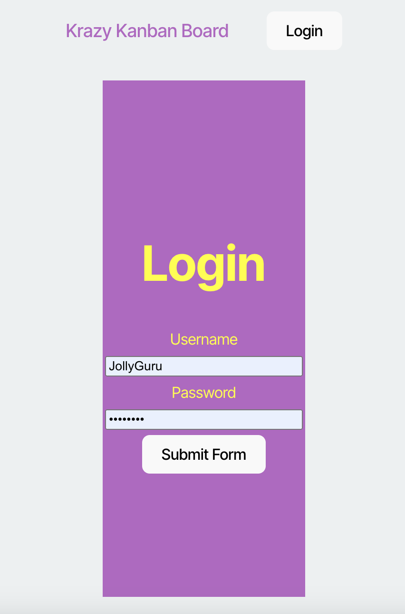
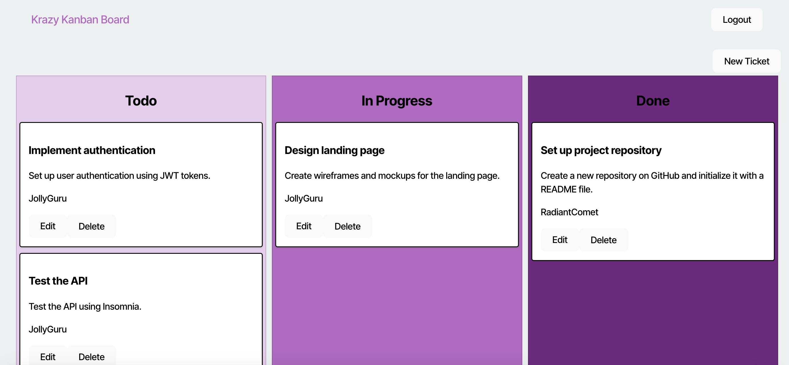

# kanBan

## Description
This project was to add authententication with JSON Web Tokens (JWTs) to the existing KanBan app in order to allow login functionality. The project also added logout functionality due to inactivity. 

## Screenshot

## Link to Deployed App
https://kanban-l43t.onrender.com/